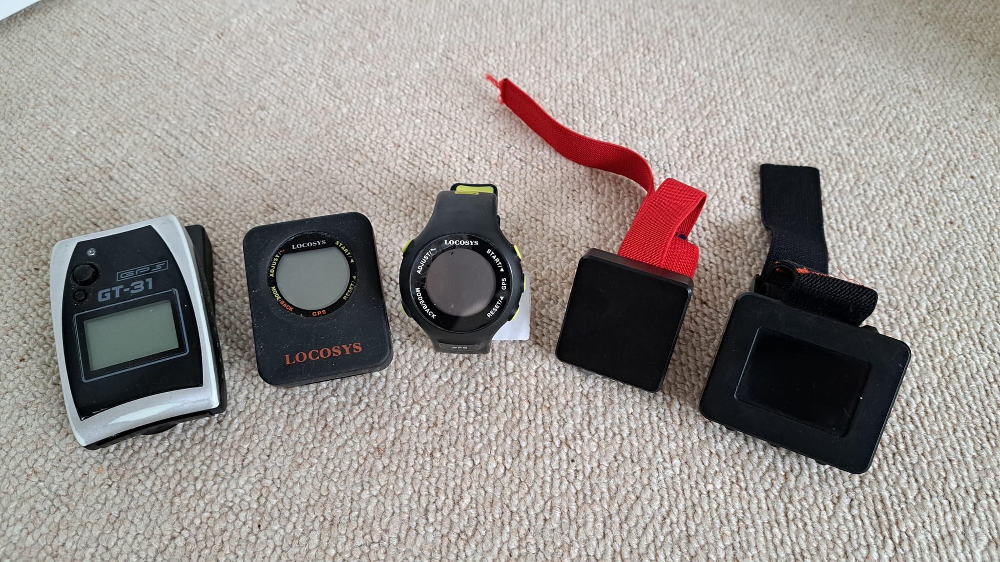

## Weymouth Speed Week

### Backup Devices

#### Overview

We have said that we accept the following backup devices, if required; GT-31, GW-52, GW-60, Motion Mini, Motion LCD.

#### Procedure

- Get the log file(s) off the device as you would at home
  - GT-31 = SDCARD
  - GW-52 = GW52Util
  - GW-60 = GW60Util
  - Motion Mini = Two presses to enable the local WiFi
  - Motion LCD = Enable local WiFi via on-screen menus / prompts
- Rename the file to match what is expected by the reporting software
  - Keep the original file extension - .sbn / .sbp / .oao
  - Ensure the filename has the correct structure - e.g. LON115JAM_656_20221021_100010.oao
    - Possibly easiest to look at previous files for the competitor, should some exist
- Add the file to the collection of OAO files that will be processed by GPSResults
