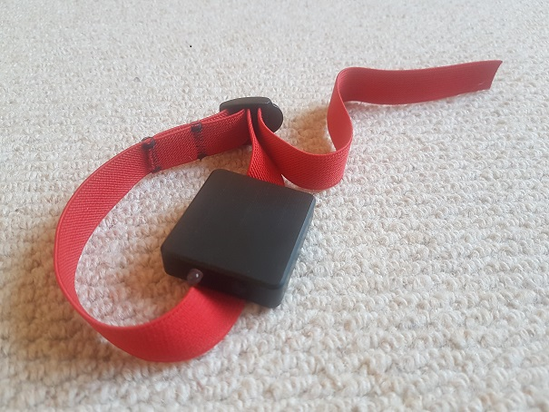
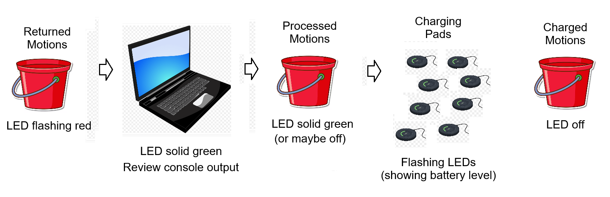
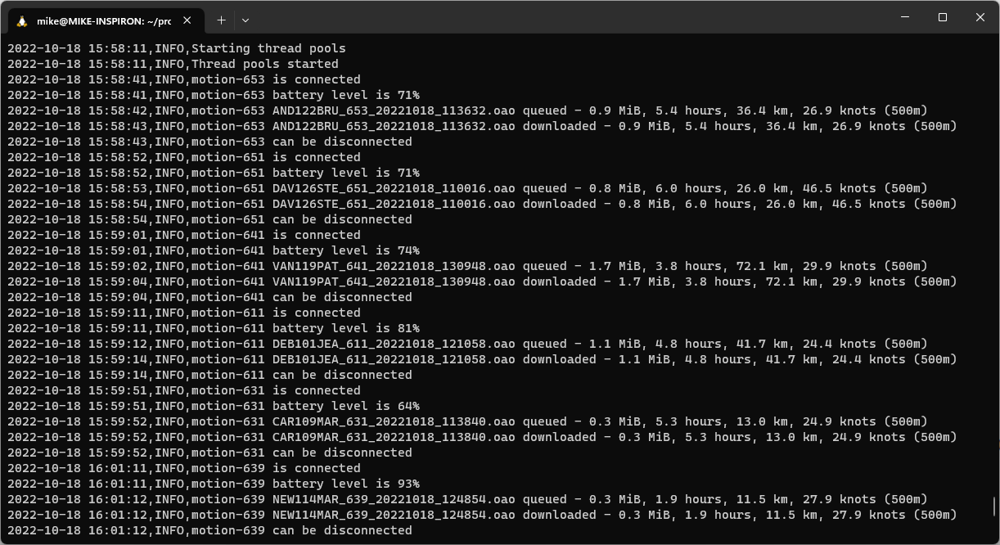

## Weymouth Speed Week

### Motion Minis

2023 will see Weymouth Speed Week using the Motion Mini with an event specific firmware for all competitors. It provides extremely accurate logging, and also supports automated downloads over WiFi at the end of the day.

#### Switching on the Motions

The team in the office will be responsible for switching on all of the Motions in the morning, just before the briefing at 9.30 am.

- Whilst the Motion is off (i.e. LED not flashing) hold the button down for 3 seconds, then release it
  - Success: LED will flash 3 times
    - green, green, green - fully charged
    - red, green, green - ok to sail
    - red, red, green - needs top up charge before sailing
    - red, red, red - needs a significant charge before going sailing
  - Failure:
    - If the LED does not flash at all then the button probably wasn't pressed properly, or for long enough
      - Try again... hold the button down for 3 seconds, then release it
    - If the LED goes solid red (after circa 6 to 8 seconds), the mini has is in the firmware update mode
      - Hold the button for 8 seconds, then release it to power down the Motion
      - Wait for 5 or so seconds for the red LED to switch off
      - If the LED is still showing red, hold the button for another 5 seconds or so, then release it
      - Now try to switch on the Motion... hold the button down for 3 seconds, then release it
- Once the Motion has been successfully switched on the LED will flash red, roughly every 10 seconds
  - Be sure to check for this red flash before handing the device to a competitor

#### End of Day

##### Overview

Here's a quick overview of what needs to be done for all of the Motions. It is best performed by two persons; one person turning on the motions and the other person checking the console output on the laptop.

##### Initiating the Downloads

Only process 4 motions at a time, or it becomes very hard to keep track of everything that is happening

- Motions should be returned to the office still switched on (i.e. LED flashing red, every 10 seconds or so)
  - Motions that are switched off (LED not flashing red) will need to be switched back to be processed
    - Please make a note of the Motion number, so that we can double-check the GPS logs are complete

- Press the button three times at approximately 1 second intervals. This will initiate a connection to the WSW WiFi
  - The LED will alternate between red and green, indicating the motion is connecting to the WiFi
    - The LED will go solid green when it has connected to the WiFi successfully
      - Next step... check what the laptop says has been found on the device and what has been downloaded
  - If the LED goes straight to green (without alternating red and green) then the Motion has switched on its built-in WiFi
    - Exit the built-in WiFi mode by pressing the button twice, 1 second apart
      - Try to connect to the WSW WiFi by pressing the button 3 times, watching for the alternating red / green lights
- Once the Motion is on the WSW WiFi and data has been downloaded (see section below), place the Motion into the "processed" bucket
  - n.b. The green LED should still be on, showing that it is still connected to the WiFi

It is quite important to only do 4 downloads at a time, and confirming that all 4 have succeeded, prior to moving on to another 4 Motions.

##### Confirming the Downloads

- The process running on the laptop reports everything via a simple console window, much like the screenshot below
  - It will report when it detects a Motion joining the WiFi, and it will report the battery level
  - It will also report when files are queued for download, and it will report when the files have been successful downloaded
  - Finally, it will report when all of the downloads for a Motion have been completed, saying "motion-123 can be disconnected"
    - There is no need to do anything more to the motion at this time, simply place it into the "processed" bucket
- Things to check in the console messages
  - The filename will match the sticker on the GPS, so filenames are useful for identifying which unit have been processed (and the dates / times)
  - Check how many hours worth of data have been downloaded - they should all be similar as all of the Motions were turned on together
    - If the number of hours seems particularly short, make a note so that we can check the GPS log is complete
  - Check the 500 meters, if you want an inkling how fast people were going - n.b. kites will typically have driven along the causeway
- Notes
  - The time in the console messages is reported in UTC (GMT), but that is intentional
  - The laptop needs to be connected to the WSW WiFi, if it see the Motions and download the data
    - The application can cope with the network being switched to / from the WSW WiFi, should that occur for any reason

##### Example Output

##### Completed Downloads

After the downloads there will be a bucket containing lots of Motions with the LED showing green.

- Switch them off one by one, simply by holding the button down until the LED turns to solid red
  - After 5 seconds (or so) the red LED will go off, indicating that the Motion has been switched off
    - Once switched off, the GPS is ready to be charged

#### Charging the Motions

We will have 48 chargers available so the Motions will have to be charged in two batches - late evening and early morning.

- 48 devices can be charged until the room closes at 6pm
  - The Motions should be removed from the charge pads prior to everyone leaving the room overnight
    - Keep the charged motions well away from the motions that still need to be charged in the morning
- The remaining 48 devices can be charged when room opens at 8am

#### Switching on the Motions

All motions can be switched on, just before the briefing at 9.30 am, so they are ready for collection straight afterwards

  - The WSW team will switch all of the motions on, and check for the red LED flashes, prior to them being picked up by competitors
  - This is described at the top of this document