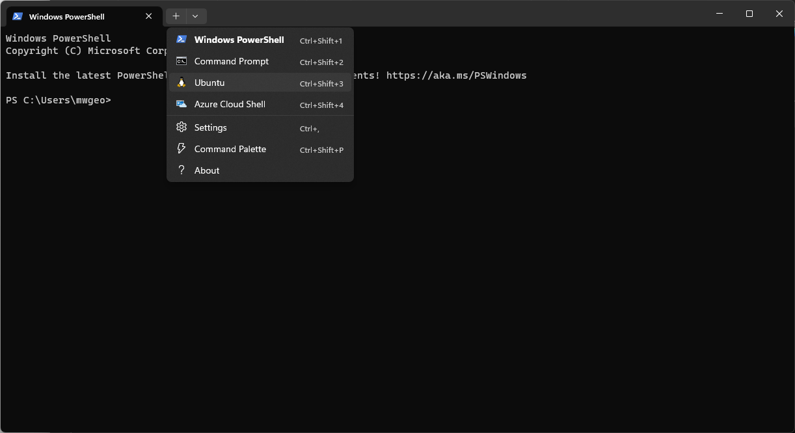

## Weymouth Speed Week

### Motion Server

The Motion server is what we use to extract data from the Motions at the end of each day.

- Open Windows Terminal using the icon on the task bar
- Start a Ubuntu session using the down arrow at the top-left of the window



- Press ctrl-c when asked for a passphrase, it is related to the wsw-results repository on GitHub
- Start the server using the following commands

```sh
cd projects/work/wsw-results
bin/server.sh
```

That's it, the server is running.

Check that the laptop is connected to the the WSW WiFi, should there be any issues.