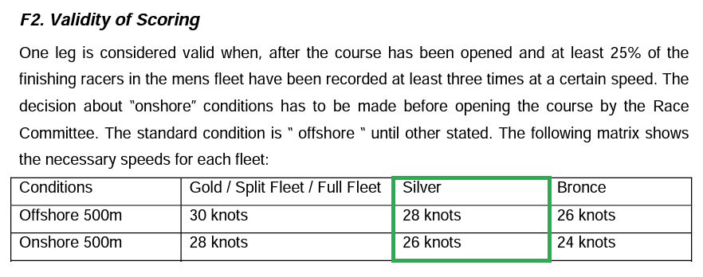

## UKWA Speed Championships

### Overview

There is a desire to tweak the rules of the UKWA Speed Championships so that moderately windy days can become valid legs. The current criteria are a simplification of the ISWC rulebook, which apply to international speed windsurfing competitions. Whilst the ISWC rules work fine for very windy days and light wind days, they don't always work so well for moderately windy days during the UKWA event.

The average ability of a UKWA competitor is lower than that of an international competitor, so refinements to the UKWA rules should allow for this fact. The proposed criteria are for 25% of the fleet to achieve 27 knots at least twice, or 50% of the fleet to achieve 25 knots at least twice. The effect of this change has been tested using all of the UKWA Speed Championship legs between 2010 to 2023.

Weymouth Speed Week are also considering some craft-specific "fun" series to encourage daily participation. The "fun" series would be similar to the UKWA series, but with different speed criteria. The "fun" series probably won't have official prizes or trophies, but are expected to provide riders with additional "purpose" on the less windy days.

### Existing Rules

In recent years the UKWA has used the following criteria for legs to be considered valid:

> 1.1 Windsurfing Rounds will only count towards the UKWA windsurfing ranking, when 25% of the riders registered achieve over 28 knots two times. One completed round is needed to ratify the event.
>
> 1.2 Wing Foiling Rounds will only count towards the UKWA Wing Foiling ranking, when 25% of the riders registered achieve over 18 knots two time. One completed round is needed to ratify the event.

### Considerations

A number of points need to be considered with respect to the UKWA validation criteria:

- The average ability of UKWA windsurfers at Weymouth Speed Week is lower than those attending international competitions
  - Likewise, Portland Harbour cannot be considered a world class venue nowadays, unlike places like La Palme / Plage du Rouet
  - Speed criteria applied during an international speed competition serve as a proxy for the quality / suitability of the conditions
  - Speed criteria applied during the UKWA Speed Championships not only reflect the conditions, but also the profile of the fleet
- The daily UKWA participation averages 19 persons (valid legs between 2010 and 2023), so speed criteria typically apply to 5 riders
  - Just one or two fewer pro riders (rather than the conditions) can result in a UKWA leg being deemed valid, or not
  - The number of UKWA pro fleet riders competing all week during the championship has fluctuated in recent years
  - On average there have been 6 pro UKWA riders participating all week (2013 - 2023), but in 2023 there were only 4 UKWA pros
- Weymouth Speed Week is primarily about participation and should be encouraging people to sail whenever possible
  - It should be noted that when UKWA youths (typically amateurs) are sailing it reduces the chances of UKWA leg(s) being valid
  - Legs that would be valid mid-week could be deemed invalid during the weekend, simply due to participation of UKWA youths
  - This proposal uses 25% and 50% criteria to improve the statistical robustness of the rules

### Data Analysis

A significant amount of analysis has been undertaken prior to presenting this proposal, using all possible 116 UKWA legs between 2010 and 2023. The full analysis will not be written up in detail because it would take several days to do so clearly and be easily understood.

The analysis has investigated median speeds of the fleet, relevance of the interquartile ranges, restricting the speed criteria to mens pro + gold fleet sailors, changes to the speed criteria and the effect of different speed criteria for shore / harbour courses.

The most effective solution simply uses two independent criteria, which are more [robust](https://en.wikipedia.org/wiki/Robust_statistics) than a single criteria:

- 25% of the fleet achieving over 27 knots
- 50% of the fleet achieving over 25 knots

The basis for the 50% criteria has been derived from all 116 of the UKWA Speed Championship legs between 2010 and 2023:

When applied to all previous UKWA Speed Championships, 2 days / 3 legs in recent years are affected by this change:

- Legs 1 and 2 on Wed [11 Oct 2023](https://logiqx.github.io/wsw-results/results/2023/20231011/ukwa.html) would be deemed valid
- Leg 2 on Tue [18 Oct 2022](https://logiqx.github.io/wsw-results/results/2022/20221018/ukwa.html) would be deemed valid

In addition to the 2 days / 3 legs in 2023 and 2022, another 9 legs between 2011 and 2016 are also deemed valid.

### UKWA Series

The average UKWA windsurfers cannot be expected to perform at the same level as competitors attending an international competition. The criteria for 25% of the fleet is therefore proposed to be 27 knots, and the equivalent for 50% is proposed as 25 knots.

The wording below is similar to the ISWC rulebook, which is referenced at the end of this document.

Windsurf / Windfoil:

> One leg is considered valid when at least 25% of the finishing racers in the UKWA mens fleet have been recorded at least two times at 27 knots, or 50% of the finishing racers in the UKWA mens fleet have been recorded at least two times at 25 knots.

Wingfoil:

> One leg is considered valid when at least 25% of the finishing racers in the UKWA mens fleet have been recorded at least two times at 25 knots, or 50% of the finishing racers in the UKWA mens fleet have been recorded at least two times at 23 knots.

The proposed speed requirements for the UKWA wingfoil fleet have been determined using 2022 and 2023 results.

### Fun Series

Weymouth Speed Week are considering an additional "fun" series to encourage daily participation from sailboard / wingboard / kiteboard competitors, running alongside the UKWA Speed Championships. The format of the "fun" series will be practically identical to the UKWA Speed Championships, including the same pre-agreed times for lunch.

All sailboard / wingboard / kiteboard participants of Weymouth Speed Week will automatically be entered into the applicable "fun" series, regardless of UKWA membership. There will be several "fun" series, either catering for all six combinations of sailboard / wingboard / kiteboard and men / women, or three individual series for sailboards, wingboards, and kiteboards (i.e. combining men and women).

The WSW course(s) will remain open during pre-agreed lunch breaks. Competitors will still be free to do runs during the lunch break, which will qualify for daily tankards and end of week prizes. However, runs during the lunch period will not count towards the UKWA Speed Championships or the WSW "fun" series. Like the UKWA series, "fun" series will have a maximum of two legs each day; AM and PM.

The proposed rules for the "fun" series are very similar to those of the UKWA series, just using relaxed speed criteria. For simplicity, all fleets will use speed criteria that are two knots lower than the UKWA Speed Championships. In particular, reduced sailboard speed criteria have been chosen to allow for healthy competition on hydrofoils when the wind is light, but not too light.

Sailboard:

> One leg is considered valid when at least 25% of the finishing UKWA racers in the mens fleet have been recorded at least two times at 25 knots, or 50% of the finishing UKWA racers in the mens fleet have been recorded at least two times at 23 knots.

Wingboard:

> One leg is considered valid when at least 25% of the finishing UKWA racers in the mens fleet have been recorded at least two times at 23 knots, or 50% of the finishing UKWA racers in the mens fleet have been recorded at least two times at 21 knots.

Kiteboard:

> One leg is considered valid when at least 25% of the finishing UKWA racers in the mens fleet have been recorded at least two times at 25 knots, or 50% of the finishing UKWA racers in the mens fleet have been recorded at least two times at 23 knots.

### Conclusions

Tweaking the speed criteria of the UKWA Speed Championships will allow for moderately windy days to deemed as valid legs. The changes aren't huge and have been proposed to account for differences between average UKWA riders and international riders.

Analysis of historical data has shown that a total of 12 legs are affected between 2010 and 2023. It is perhaps significant that this includes both legs on Wed [11 Oct 2023](https://logiqx.github.io/wsw-results/results/2023/20231011/ukwa.html) and the second leg on Tue [18 Oct 2022](https://logiqx.github.io/wsw-results/results/2022/20221018/ukwa.html), all of which are deemed valid by the revised criteria.

The "fun" series with slightly relaxed speed criteria are to encourage daily participation from all sailboards, wingboards, and kiteboards. These probably won't have official prizes or trophies, but are expected to provide riders with additional "purpose" on the less windy days.

### Reference

The following section from the ISWC rulebook has been used as reference.

The average UKWA competitor is not of an international standard, so 27 knots has been chosen for the 25% rule:

> One leg is considered valid when at least 25% of the finishing racers in the UKWA mens fleet have been recorded at least two times at 27 knots, or 50% of the finishing racers in the UKWA mens fleet have been recorded at least two times at 25 knots.

The 50% criteria of 25 knots was determined using all of the UKWA Speed Championship data between 2010 and 2023.
