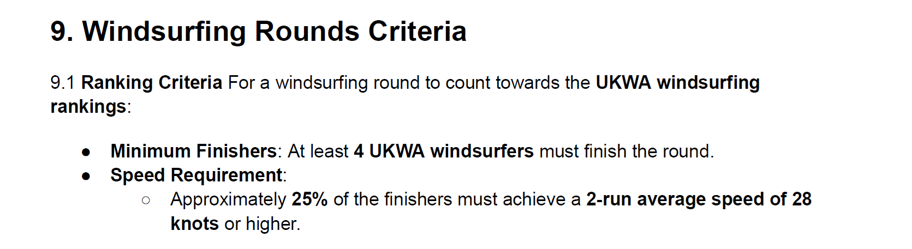
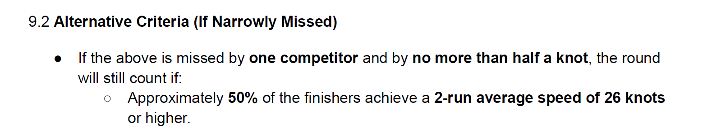
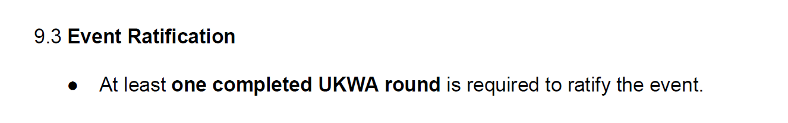
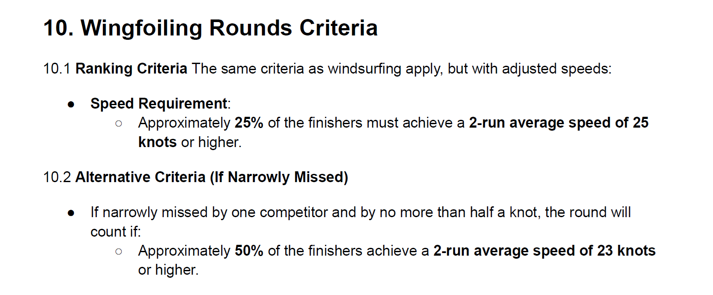
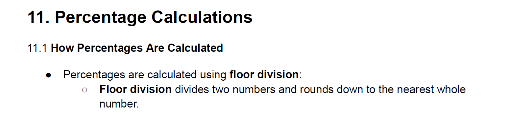
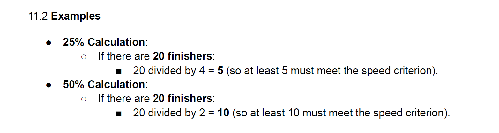

## Official British Championships NOR

### Feedback

The formatting is nice, but there are ambiguities and inconsistencies.

The rules up until 2023  were written in a way that  did not reflect the true intention. We therefore  had a number of rounds which were deemed invalid, simply because the rules were applied as they were written.

For this reason it is imperative that new rules be written in a way that is wholely unambiguous. It is difficult to write them so they are unambiguous as there are numerous pitfalls.

Here is a quick summary of where the NOR has issues and needs to be amended.

- "Approximately 25% of the finishers ..."
  - Ambiguity - Does "25% of finishers" refer to the WSW competitors, or just the UKWA competitors?
    - The original draft explicitly defined the "finishers"  and to which rules it applied.

- "If the above is missed by one competitor"
  - Ambiguity - What if it is missed by 2 (or more) competitors with speeds just under 28 knots?
    - Example 1.  8 competitors - 29.0, 27.9, 27.9, 27.9, 27.9, 27.9, 27.9, 27.9
      - The second fastest competitor has just missed 28 knots, but not by more than half a knot.
      - If interpreted strictly this would be deemed non-counting, because this applies to more than one person.
    - Example 2. 8 competitors - 29.0, 27.9, 27.0, 26.0, 25.0, 24.0, 23.0, 22.0
      - The second fastest competitor has just missed 28 knots, but the rest of the fleet are much slower this time.
      - Unlike the first example this would be deemed counting, because only one person has narrowly missed 28 knots.

- Fine

- For consistency this should perhaps also specify the minimum number of finishers, also 4?
- It has since been agreed to use 24 and 22 knots for wings, but that probably wasn't passed on.
- There is no equivalent of event ratification that was defined for windsurfers (see 9.3).

- "How percentages are calculated... Percentages are calculated using floor division"
  - These sentences make no mathematical sense. In this context the result is a number, not a percentage.
- "Floor division divides two numbers and rounds down to the nearest whole number."
  - This is not the definition of floor division, and is at best ambiguous.
- Dividing 20 by 4 gives 5, then rounding down to the nearest whole number gives 4, according to this definition.
  - There is a reason why the standard definition includes "less than or equal to the division result".

  

- "20 divided by 4 = 5" and "20 divided by 2 = 10".
  - These are trivial examples and don't provide any value in isolation.
  - They are in contradiction with the (incorrect) definition of floor division, described earlier.
  - The original examples included 23 to illustrate the application of floor division.

### Summary

The reference to "finishers" has a vagueness which was addressed in the original draft. This could be misinterpreted, or abused by using the full WSW fleet. Rules should be unambiguous, and not require interpretation.

The original proposal made a point of saying that the system is not based on percentages. The laymen rules referred to "circa 25%" to obfuscate the true nature of the calculation, but from thereon there was no reference to percentages, only the use of floor division.

The wording "missed by one competitor" is ambiguous, but if it were to be strictly applied then any rounds with lots of people just missing the 28 knots threshold would be deemed invalid. This is not the intention of the new system.

The section describing how percentages are calculated is inaccurate and makes no sense mathematically. People working in my industry would be ridiculed for writing something like that in a specification.

The original draft was carefully crafted to avoid any ambiguities and inconsistencies. It referred to circa 25% by way of compromise, prior to accurately describing the calculations, and making it clear that they are not based around percentages.

It is unfortunate that the rules are so complex that we are in a situation where writing them can easily lead to ambiguities and inconsistencies. Far simpler rules are possible, including use of genuine percentages if the threshold was lowered to 27 knots.

