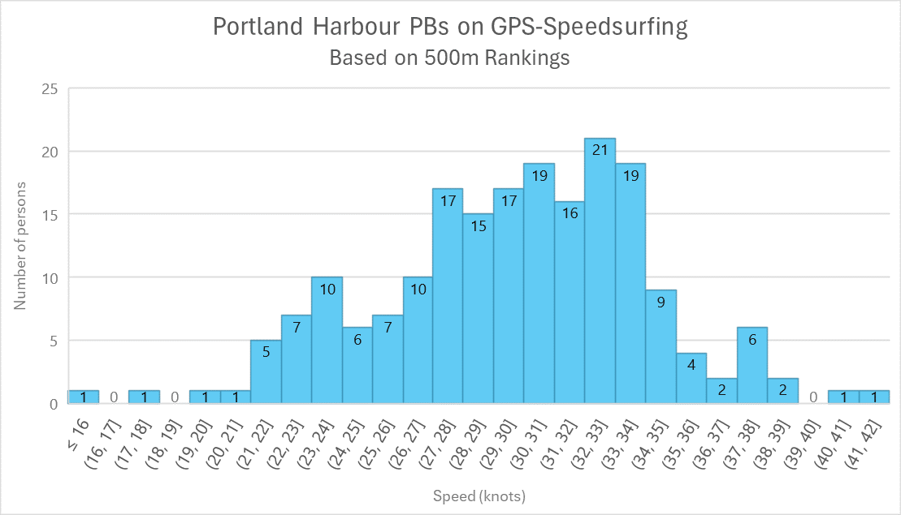
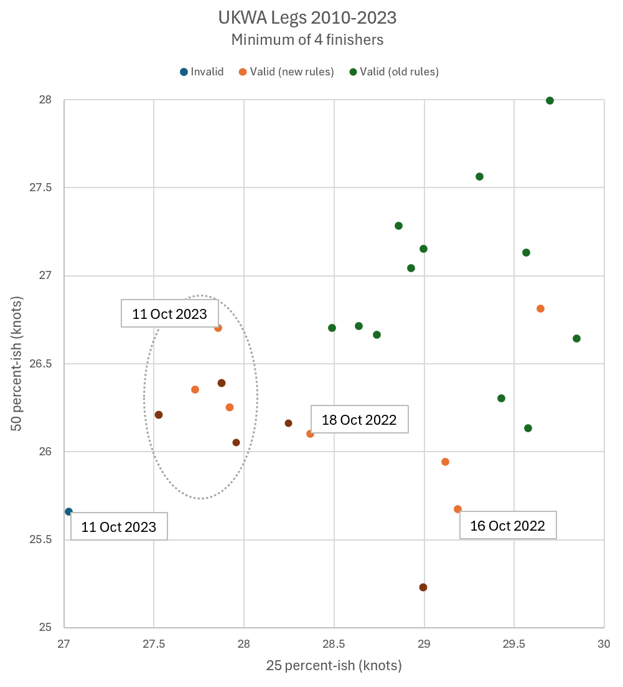

## UKWA Speed Championships

Author: Michael George

Created: 14 Aug 2024

### Overview

There is a desire to tweak the rules of the UKWA Speed Championships so that moderately windy days can become valid rounds. The current criteria are a simplification of the ISWC rulebook, which applies to international speed windsurfing competitions. Whilst the current UKWA rules work well for very windy days and light wind days, they don't always work so well for moderately windy days during Weymouth Speed Week.

### Chance Variability

The existing rules essential consider the results of a single rider, who approximates the top 25% of the fleet. Typically, 1 or 2 specific riders will tip the balance as to whether it is a counting round, or not. [Chance variability](chance-variability.pdf) means that results will never be perfectly distributed.  The results during a specific round may approximate a specific distribution, but they will always be affected by chance variability.

This can be illustrated using the 500 m rankings for Portland Harbour on GPS-Speedsurfing, representing almost 200 riders. It's worth noting that these are personal bests, and should not be regarded typical results for Portland Harbour. It should also be noted that the distribution is not perfect, because the 500 m rankings are affected by chance variability; rider, equipment, general conditions, lucky gust, etc.

The simplest way to address the variability issue is to also consider a second rider who is close to the middle of the UKWA fleet. A [proposal](../proposal-1/README.md) was drawn up during Nov 2023 which established a clear relationship between 50% and 25% of the fleet for all UKWA rounds between 2010 and 2023.

The proposal was discussed by Pete Davis, Zara Davis, and Michael George at the WPNSA on 12 Aug 2024. The outcome of that discussion was an alternative proposal which addresses the primary cause of concern; e.g. 4 riders in light winds (including 2 foils doing 25+ knots) being deemed valid.

### UKWA Rules

#### Existing Rules

In recent years the UKWA has used the following criteria for rounds to be considered valid:

> 1.1 Windsurfing Rounds will only count towards the UKWA windsurfing ranking, when 25% of the riders registered achieve over 28 knots two times. One completed round is needed to ratify the event.
>
> 1.2 Wing Foiling Rounds will only count towards the UKWA wing foiling ranking, when 25% of the riders registered achieve over 18 knots two time. One completed round is needed to ratify the event.

#### Proposed Rules

The following criteria are proposed for rounds to be considered valid.

> 1.1 The // operator represents [floor division](https://www.designgurus.io/answers/detail/what-is-floor-division), which only ever rounds down - e.g. 12 // 4 = 3, and 14 // 4 = 3.
>
> 2.1 Windsurfing rounds will count towards the UKWA windsurfing ranking, if both of the following conditions are met:
>
> - There are at least 4 UKWA windsurfers who finish the round, referred to as the number of finishers (NF).
> - The number of required UKWA windsurfers (NR) have a 2-run average of 28 knots (or higher), where NR = NF // 4.
>
> 2.2 Windsurfing rounds will also count towards the UKWA windsurfing ranking, if all of the following conditions are met:
>
> - There are at least 4 UKWA windsurfers who finish the round, referred to as the number of finishers (NF).
> - The 28 knots criteria is only missed by one competitor, and the competitor has a 2-run average of 27.5 knots (or higher).
> - The number of required UKWA windsurfers (N) have a 2-run average of 26 knots (or higher), where N = total number of finishers // 2.
>
> 2.3 A minimum of one completed UKWA windsurfing round is required to ratify the event.
>
> 3.1 Wingfoiling rounds will count towards the UKWA wingfoiling ranking, if both of the following conditions are met:
>
> - There are at least 4 UKWA wingfoilers who finish the round, referred to as the number of finishers (NF).
> - The number of required UKWA wingfoilers (NR) have a 2-run average of 25 knots (or higher), where NR = NF // 4.
>
> 3.2 Wingfoiling rounds will also count towards the UKWA wingfoiling ranking, if all of the following conditions are met:
>
> - There are at least 4 UKWA wingfoilers who finish the round, referred to as the number of finishers (NF).
> - The 25 knots criteria is only missed by one competitor, and the competitor has a 2-run average of 24.5 knots (or higher).
> - The number of required UKWA wingfoilers (NR) have a 2-run average of 23 knots (or higher), where NR = NF // 2.
>
> 3.3  A minimum of one completed UKWA wingfoiling round is required to ratify the event.

The 28 knots + 26 knots requirements (windsurfing) and 25 knots + 23 knots requirements (wingfoiling) have all been described individually. The goal has been to write rules that are consistent, unambiguous, and easy to apply. There are other ways to convey these same rules, including the use of reference tables, etc.

### Validation

Quite a lot of analysis has been completed after the meeting and prior to writing this proposal, considering all possible 116 UKWA rounds between 2010 and 2023. The full analysis will not be written up in detail because it would take a long time to do so clearly. This document is merely a brief summary.

The scatter plot below shows the relationship between the 2-run averages being recorded by 25-ish percent versus 50-ish percent of the fleet. The phrase "ish" has been used because the actual calculation is based on [floor division](https://www.designgurus.io/answers/detail/what-is-floor-division), essentially rounding down / towards zero.

The scatter plot shows at a glance which UKWA rounds are deemed valid since 2010, based on the old rules and newly proposed rules. The orange dots are the most important in the context of this proposal. 

It should be apparent that the orange dots are rounds that would be deemed valid by the new rules. The cluster that has been highlighted by an ellipse is due to the newly introduced 26 knots criteria, which only kicks in when a single competitor fails to meet the 28 knots criteria and by less than 0.5 knots.

Zooming in to the most interesting area, we can see that 4 rounds in 2022 and 2023 have been highlighted. The cluster within the ellipse is deemed valid under the mid-fleet criteria (over 26 knots) and the other orange dots are deemed valid because of the use of floor division, instead of rounding up.

Orange dots to the right of 28 knots on the x-axis are due to the use of floor division (not rounding up). The dark orange dots are the rounds which only meet the 28 knots / 26 knots criteria because the proposals uses 2-run averages, rather than requiring two runs exceeding 28 / 26 knots.

In total the new rules consider an additional 12 rounds to be valid since 2010, including 2 rounds from 2022 (>28 knots, floor division) and 1 round from 2023 (new 26 knots criteria). The new 26 knots criteria for the middle of the fleet is only applied under the circumstances described earlier.

### Summary

This new proposal is the product of a discussion between Pete Davis, Zara Davis and Michael George on 12 Sep 2024.

The proposed rules are more lengthy than previous ones, but they have been written to be consistent, unambiguous, and easy to apply. The use of [floor division](https://www.designgurus.io/answers/detail/what-is-floor-division) keeps the new rules straightforward, whether writing software or applying them manually.

The scatter plots show how 12 additional rounds would be deemed valid by the newly proposed rules, but not the old rules. 3 of those 12 rounds were during 2022 and 2023, and there was another borderline round in 2023 . That round was 11 Oct 2023 and is still deemed invalid by the proposed rules.

The old rules deemed 49 rounds valid between 2010 and 2023, so the additional 12 rounds represent an increase of 25%. Looking back at the two scatter plots, it can be seen that these additional 12 rounds are confined to 2 distinct clusters. There is also one rogue orange dot amongst the green dots!

There was some additional analysis relating to use of the the upper quartile and median, traditional rounding, and consideration of rounding half to even (aka [bankers rounding](https://wiki.c2.com/?BankersRounding)). In the interests of simplicity, floor division was used (consistent with the meeting) for the sake of simplicity and consistency.

This page covers some topics that are are a little hard going, but hopefully describes the new rules and demonstrates their effect for anyone interested.

### Sources

Lecture notes by Elizabeth A. Thompson, professor of statistics at Washington University.

- STAT220: Basic Statistics - [CHANCE VARIABILITY](https://faculty.washington.edu/eathomp/S220_06/Lectures/notes6.pdf)
