## Review of Proposal

This document allows the newly proposed rules to be reviewed, quickly and easily.

The new rules were applied to all UKWA legs since 2010 and compared to the results of the old rules, which were "strictly" applied.

### 28 knots (or higher)

Definitions:

> Legs will be deemed valid if the required number of finishers have a 2-run average of 28 knots (or higher).
>
> The required number of finishers is defined as the total number of finishers // 4, where // represents [floor division](https://www.designgurus.io/answers/detail/what-is-floor-division).

Additional notes:

- The previous "strict" approach always rounded upwards, and checked the best 2 runs.
- 3 of the 6 legs listed below satisfy the proposed 28 knots criteria, but not the proposed 26 knots criteria.

#### 2012-10-09

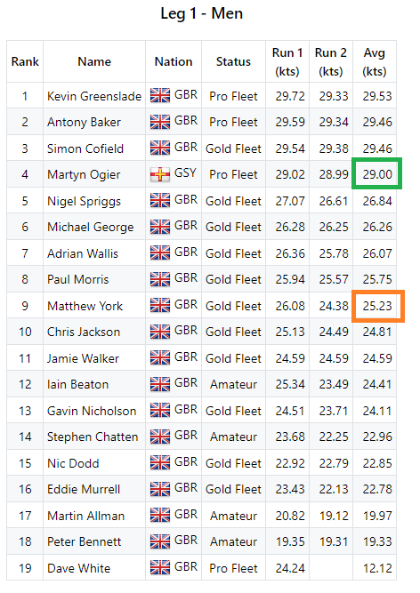

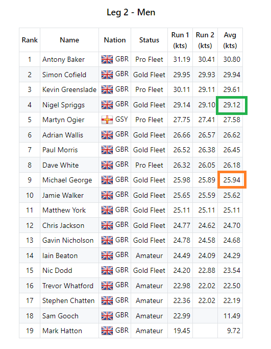

#### 2012-10-10

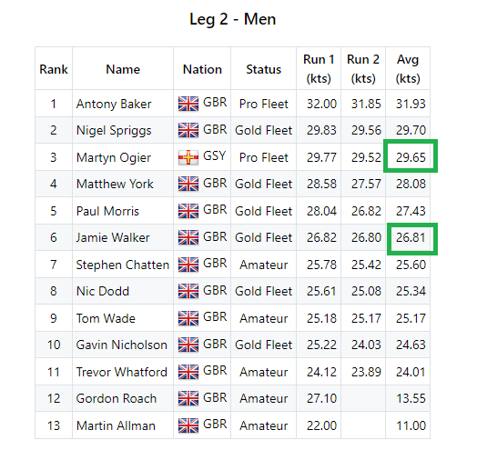

#### 2014-10-18

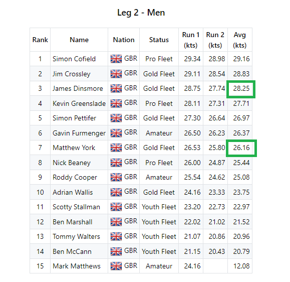

#### 2022-10-16

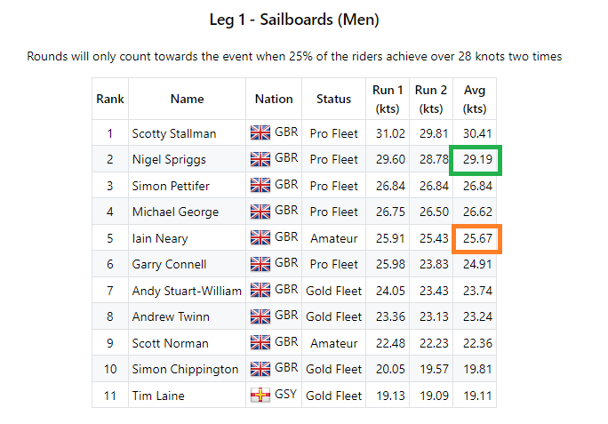

#### 2022-10-18

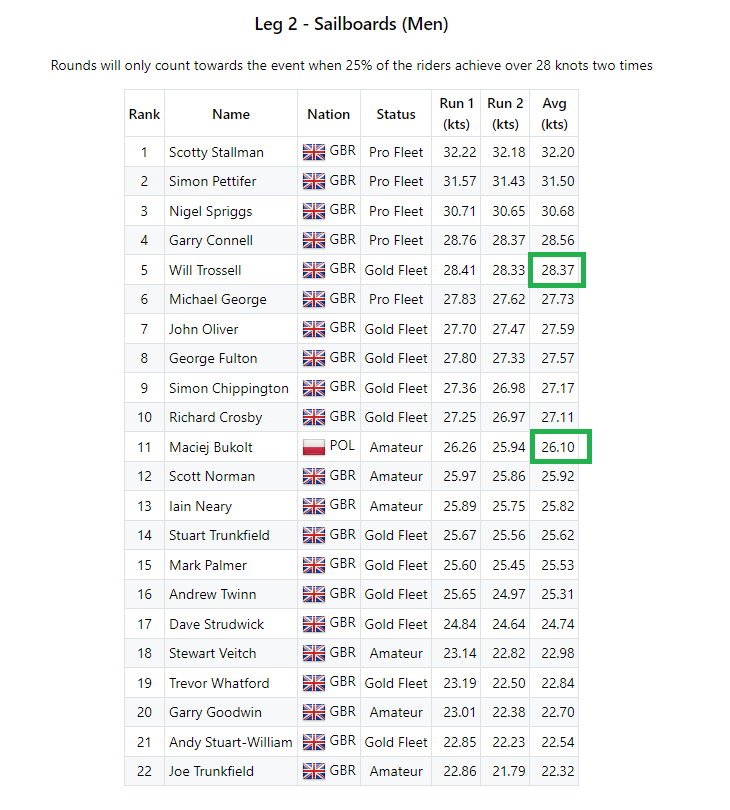

### 26 knots (or higher)

Definition:

>  In addition to the 28 knots criteria, legs will also be deemed valid if both of the following conditions are met:
>
> - The 28 knots criteria is only missed by one competitor, and that competitor has an average of 27.5 knots (or higher).
> - The required number of open fleet finishers have a 2-run average of 26 knots (or higher).
> 
> The required number of open fleet finishers is defined as the total number of open fleet finishers // 4, where // represents [floor division](https://www.designgurus.io/answers/detail/what-is-floor-division).

#### 2011-10-19

26 knots criteria... several mid-fleet doing 26+ knots.

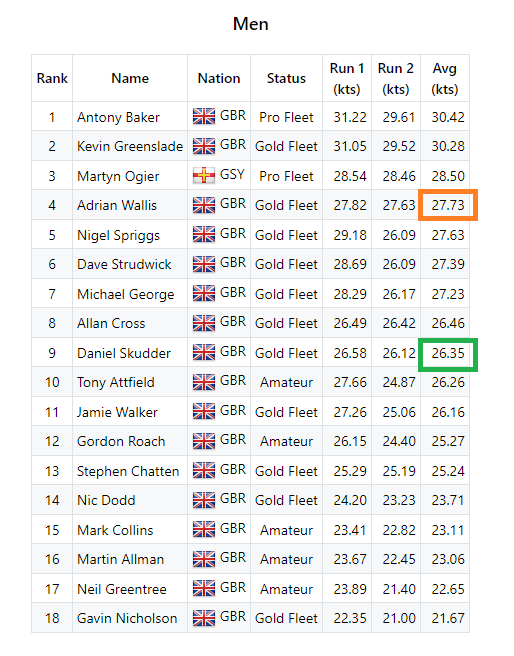

#### 2013-10-14

26 knots criteria... several mid-fleet doing 26+ knots.

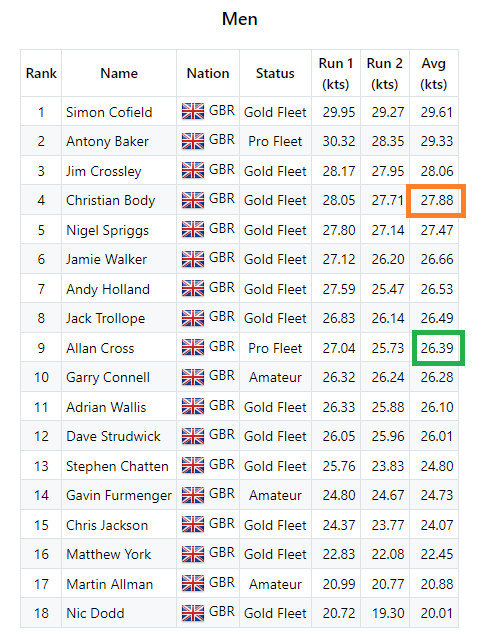

#### 2014-10-18

26 knots criteria... several mid-fleet doing 26+ knots.

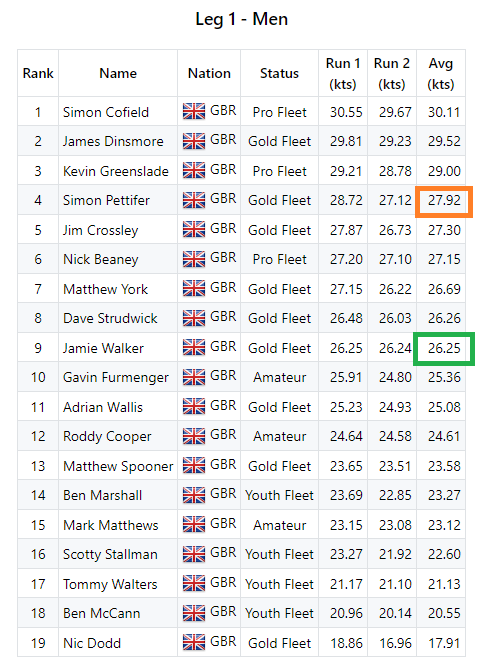

#### 2015-10-05

26 knots criteria... several mid-fleet doing 26+ knots.

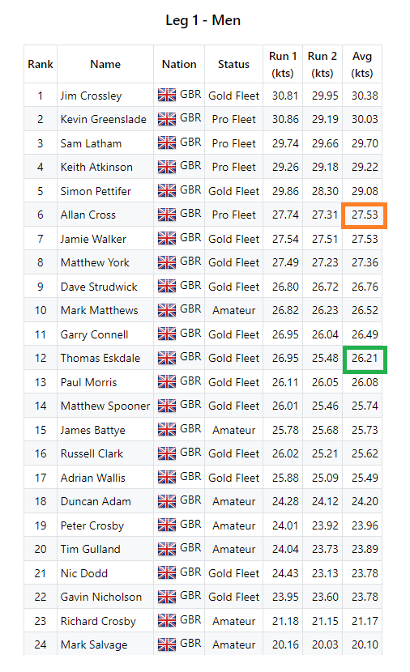

#### 2016-10-12

26 knots criteria... several mid-fleet doing 26+ knots.

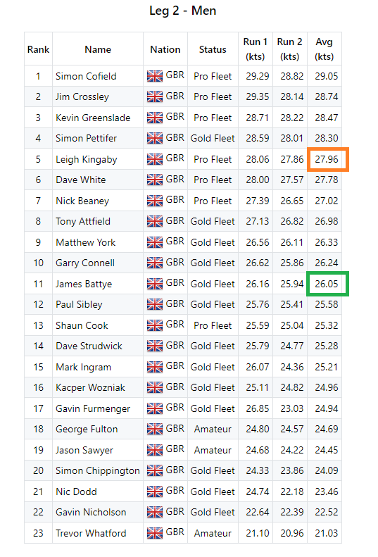

#### 2023-10-11

26 knots criteria... several mid-fleet doing 26+ knots.

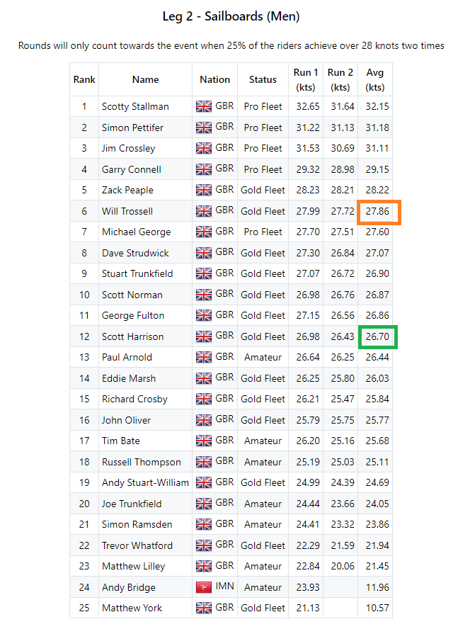

### Links

Here are links to all 12 of the legs:

- [20111019 / UKWA - Men / Shore](https://results.weymouthspeedweek.com/events/2011/20111019/ukwa.html)
- [20121009 / UKWA - Leg 1 - Men / Harbour](https://results.weymouthspeedweek.com/events/2012/20121009/ukwa.html)
- [20121009 / UKWA - Leg 2 - Men / Harbour](https://results.weymouthspeedweek.com/events/2012/20121009/ukwa.html)
- [20121010 / UKWA - Leg 2 - Men / Harbour](https://results.weymouthspeedweek.com/events/2012/20121010/ukwa.html)
- [20131014 / UKWA - Men / Shore](https://results.weymouthspeedweek.com/events/2013/20131014/ukwa.html)
- [20141018 / UKWA - Leg 1 - Men / Shore](https://results.weymouthspeedweek.com/events/2014/20141018/ukwa.html)
- [20141018 / UKWA - Leg 2 - Men / Shore](https://results.weymouthspeedweek.com/events/2014/20141018/ukwa.html)
- [20151005 / UKWA - Leg 1 - Men / Harbour](https://results.weymouthspeedweek.com/events/2015/20151005/ukwa.html)
- [20161012 / UKWA - Leg 2 - Men / Harbour](https://results.weymouthspeedweek.com/events/2016/20161012/ukwa.html)
- [20221016 / UKWA - Leg 1 - Sailboards (Men) / Harbour](https://results.weymouthspeedweek.com/events/2022/20221016/ukwa.html)
- [20221018 / UKWA - Leg 2 - Sailboards (Men) / Harbour](https://results.weymouthspeedweek.com/events/2022/20221018/ukwa.html)
- [20231011 / UKWA - Leg 2 - Sailboards (Men) / Shore](https://results.weymouthspeedweek.com/events/2023/20231011/ukwa.html)

