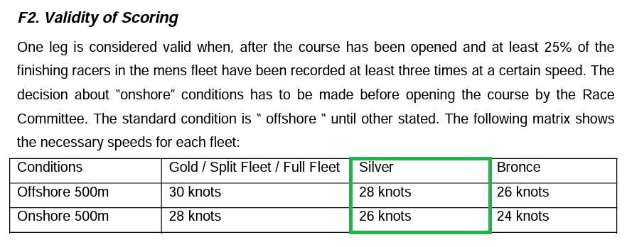

## UKWA Speed Championships

### Existing Rules

In recent years the UKWA has used the following criteria for legs to be considered valid:

> 1.1 Windsurfing Rounds will only count towards the UKWA windsurfing ranking, when 25% of the riders registered achieve over 28 knots two times. One completed round is needed to ratify the event.
>
> 1.2 Wing Foiling Rounds will only count towards the UKWA Wing Foiling ranking, when 25% of the riders registered achieve over 18 knots two time. One completed round is needed to ratify the event.

### Proposed Rules

#### Summary

The newly proposed wording is similar to that used in the ISWC rulebook, and the speed criteria are based on the ISWC rules for a silver fleet.

All criteria for a valid leg are in relation to the finishing UKWA racers in the mens pro + gold fleets:

|                                      | 25%  | 50%  |
| ------------------------------------ | ---- | ---- |
| Windsurf / Windfoil - Shore course   | 28   | 26   |
| Windsurf / Windfoil - Harbour course | 26   | 24   |
| Wingfoil - Shore course              | 25   | 23   |
| Wingfoil  - Harbour course           | 23   | 21   |

#### Windsurfers + Windfoilers

Shore course

> One leg is considered valid when at least 25% of the finishing UKWA racers in the mens pro + gold fleets have been recorded at least two times over 28 knots, or at least 50% of the finishing UKWA racers in the mens pro + gold fleets have been recorded at least two times over 26 knots.

Harbour course

> One leg is considered valid when at least 25% of the finishing UKWA racers in the mens pro + gold fleets have been recorded at least two times over 26 knots, or at least 50% of the finishing racers in the mens pro + gold fleets have been recorded at least two times over 24 knots.

#### Wingfoilers

Shore course

> One leg is considered valid when at least 25% of the finishing UKWA racers in the mens pro + gold fleets have been recorded at least two times over 25 knots, or at least 50% of the finishing UKWA racers in the mens pro + gold fleets have been recorded at least two times over 23 knots.

Harbour course

> One leg is considered valid when at least 25% of the finishing UKWA racers in the mens pro + gold fleets have been recorded at least two times over 23 knots, or at least 50% of the finishing UKWA racers in the mens pro + gold fleets have been recorded at least two times over 21 knots.

### Reference

The following section from the ISWC rulebook has been used as reference. Since the UKWA competitors are on average not of an international standard the speed requirements for "silver" fleet may be applied to UKWA competitors in the pro fleet and gold fleet.

